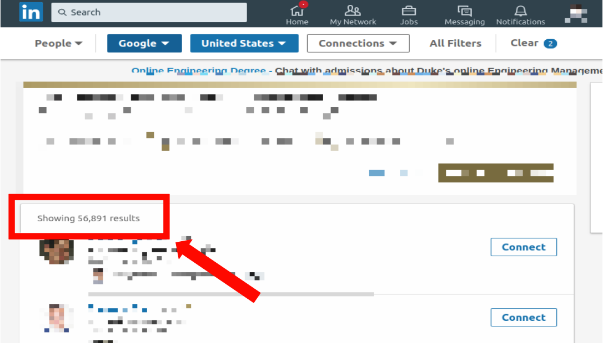

# Selenium-LinkedIn-scraper

LinkedIn scraper with python selenium and docker

## Project background

### What I need?
I was curious roughly how many employees are working at certain company in US.

### Why LinkedIn?
Most of people who is working in US use LinkedIn and updates their current working company when they change the company.

With LinkedIn search functions, you can get get
approximate number of employees on the company.



### What is bottle-neck?
To get a number of employees in certain company in US from LinkedIn, you have to change your search filter on each company. (Check this [page](https://www.linkedin.com/search/results/people/?origin=FACETED_SEARCH))

What if you want to search for more than 100 companies?  
It's painful repetitive work and you might have to click a lot.
So.. I came up with to use simple scraper with python.

### Why Selenium?
[Selenium](https://www.seleniumhq.org/) is not a proper tool for scraping and It's really slow.  
Also, There are a lot of better crawling tools like [Scrapy](https://scrapy.org/), [Pyspider](http://docs.pyspider.org/en/latest/).  
But I choose to use selenium with following reasons.

  * LinkedIn is hard to use crawler. ([999 error code](https://stackoverflow.com/questions/27231113/999-error-code-on-head-request-to-linkedin))
  * With headless-chrome driver, selenium can be running on background just like other crawler.
  * I don't need massive data from LinkedIn, which means don't have to care about the speed.

### Why Docker?
Personally, installing headless-chrome driver and selenium was annoying (There were too many way to install it).  
With [Docker](https://www.docker.com/), I can guarantee that everyone running this project in same develop environment even you are using MAC or Windows.

## Prerequisites

Need to install [Docker](https://hub.docker.com/search/?type=edition&offering=community).  
You need to have [LinkedIn](https://www.linkedin.com/) account.

## Directory Structure
```bash
linkedin_scraper/
├── app.py
├── docker
│   ├── build.sh
│   └── Dockerfile
├── etc
│   └── blacklist.txt
├── Image
│   └── linkedin_result.png
├── input.csv
├── LICENSE.md
├── README.md
├── result
│   └── 201901061758
│       ├── error.csv
│       └── succeed.csv
└── scraper.sh
```

**Input file**: input.csv must have column name 'company_name', check example.  
**Result files**: Will be generated under result directory  
**Blacklist file**: You can make blacklist of input company through this file  
**Docker directory**: You can generate custom docker image through this directory.  
**Executable file**: scraper.sh will use app.py internally.

## How to use
1. **Set your company list**  
On input.csv put list of company name on 'company_name' column.   
More details about input.csv are following:
 * Must have 'company_name' column, it will only read this column
 * Redundant company_name will be treat as one company
 * You can put other column on input.csv such as company_id (check the default input.csv)
 * Default delimiter for columns is ',' (comma)

2. **Set blacklist**  
I made a blacklist.txt to prevent unwanted company on company list.  
Every company on blacklist.txt will be ignored.  
For example, oracle and google will be ignored since they are on default blacklist.

3. **Run**  
Simply run scraper.sh on your laptop will generate result file under **result** directory
```
$ # For Mac and Ubuntu
$ cd linkedin_scraper
$ ./scraper.sh
```
Result files will generated under directory named 'result/<YearMonthDayHourMinute>'.  
One is the list of company with error code that couldn't find the result. Another one is the succeed list of company.  
Check the example result directory.

4. **Customize your docker image**  
By default, It will use 'hwwwi/python-chromedriver:python3-selenium-3.8.0'.  
You can easily change Dockerfile under **docker** directory and run build.sh to make new docker image.  
Make sure to change all the variables in build.sh before make your custom docker image.  
And then, switch 'SELENIUM_IMAGE' on scraper.sh to your new image name.


## Authors

* **Hwi Han** - *Initial work* - [hwwwi](https://github.com/hwwwi)
* **Eunkyo Choi** - *Contributor* - [Eunkyooooo](https://github.com/Eunkyooooo)

See also the list of [contributors](https://github.com/hwwwi/selenium-linkedin-scraper/contributors) who participated in this project.

## License

This project is licensed under the MIT License - see the [LICENSE](LICENSE.md) file for details

## Acknowledgments

* Python3
* Selenium
* Docker
